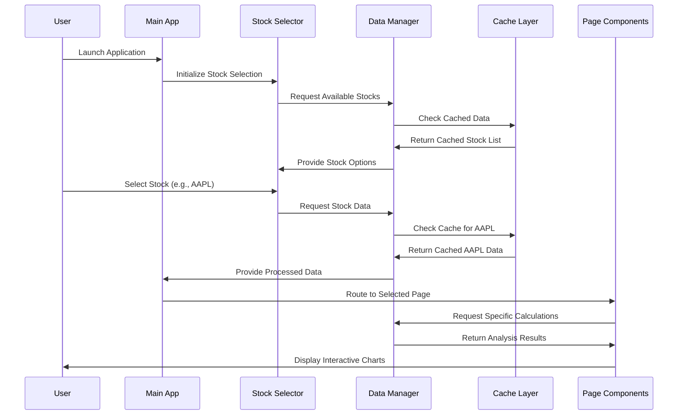
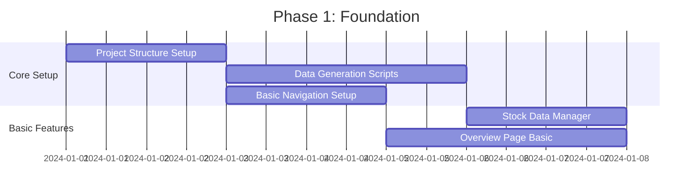
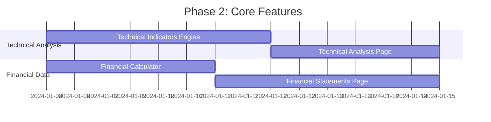
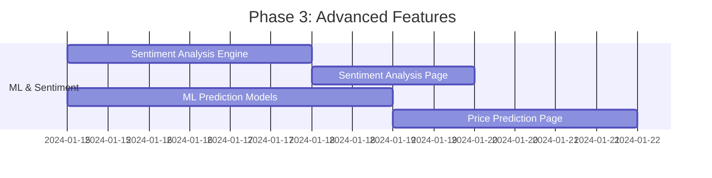
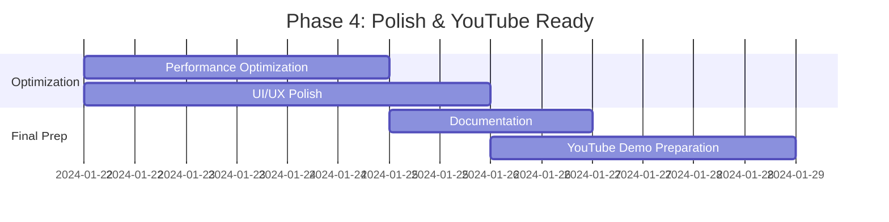

# 📊 Advanced Multi-Page Streamlit Stock Analysis Dashboard - Technical Architecture

## 🎯 Project Overview

**Objective:** Create a comprehensive financial analysis application optimized for YouTube demonstration with realistic sample data, professional UI, and advanced analytical features.

**Target:** Educational demonstration showcasing Streamlit's capabilities for financial applications with multiple pre-selected stocks (AAPL, MSFT, GOOGL, TSLA, SPY).

**Demo Approach:** Pre-recorded demonstration using cached sample data to ensure consistent performance and avoid API rate limits.

**Data Realism:** High realism with historically accurate price patterns, realistic volatility, and correlations between indicators for educational value.

## 🏗️ Overall Architecture Design

### Application Structure

```mermaid
graph TB
    A[Main App - 18_app.py] --> B[Stock Selector Component]
    A --> C[Navigation Sidebar]
    
    C --> D[📈 Overview Page]
    C --> E[🔧 Technical Analysis Page]
    C --> F[💰 Financial Statements Page]
    C --> G[📰 Sentiment Analysis Page]
    C --> H[🤖 Price Prediction Page]
    
    D --> I[Data Manager]
    E --> I
    F --> I
    G --> I
    H --> I
    
    I --> J[Cached Sample Data]
    I --> K[Technical Indicators Engine]
    I --> L[Financial Ratios Calculator]
    
    J --> M[AAPL Dataset]
    J --> N[MSFT Dataset]
    J --> O[GOOGL Dataset]
    J --> P[TSLA Dataset]
    J --> Q[SPY Dataset]
```



### File Organization

```
Part_18_Multipage_Stock_Dashboard/
├── 18_app.py                          # Main application entry point
├── ARCHITECTURE_SPECIFICATION.md      # This document
├── README.md                          # Project documentation
├── pages/
│   ├── 01_📈_overview.py              # Stock overview & charts
│   ├── 02_🔧_technical_analysis.py    # Technical indicators
│   ├── 03_💰_financial_statements.py  # Financial ratios & statements
│   ├── 04_📰_sentiment_analysis.py    # News sentiment analysis
│   └── 05_🤖_price_prediction.py      # ML predictions
├── data/
│   ├── sample_stocks/                 # Pre-generated realistic data
│   │   ├── AAPL.csv
│   │   ├── MSFT.csv
│   │   ├── GOOGL.csv
│   │   ├── TSLA.csv
│   │   └── SPY.csv
│   ├── news_samples/                  # Sample news data
│   │   ├── AAPL_news.json
│   │   ├── MSFT_news.json
│   │   ├── GOOGL_news.json
│   │   ├── TSLA_news.json
│   │   └── SPY_news.json
│   └── financial_statements/          # Sample financial data
│       ├── AAPL_financials.json
│       ├── MSFT_financials.json
│       ├── GOOGL_financials.json
│       ├── TSLA_financials.json
│       └── SPY_financials.json
├── utils/
│   ├── __init__.py
│   ├── data_manager.py               # Data loading & caching
│   ├── technical_indicators.py       # TA calculations
│   ├── financial_calculator.py       # Financial ratios
│   ├── sentiment_analyzer.py         # Sentiment analysis
│   ├── ml_models.py                  # Prediction models
│   └── chart_components.py           # Reusable chart components
├── config/
│   ├── settings.py                   # App configuration
│   └── stock_symbols.py              # Stock metadata
└── requirements.txt                   # Dependencies
```

## 🔧 Technology Stack Recommendations

### Core Libraries
```python
# Core Streamlit & Data
streamlit >= 1.28.0
pandas >= 2.0.0
numpy >= 1.24.0

# Visualization (Plotly chosen for superior financial charts)
plotly >= 5.15.0
plotly-dash >= 2.12.0

# Technical Analysis
ta-lib >= 0.4.0          # Technical indicators
pandas-ta >= 0.3.14b0    # Alternative TA library

# Machine Learning
scikit-learn >= 1.3.0
prophet >= 1.1.4         # Time series forecasting
statsmodels >= 0.14.0    # ARIMA models

# Sentiment Analysis
textblob >= 0.17.1       # Simple sentiment analysis
vaderSentiment >= 3.3.2  # Financial text optimized

# Utilities
yfinance >= 0.2.18       # For real data reference (optional)
requests >= 2.31.0
python-dateutil >= 2.8.2
```

### Visualization Choice: **Plotly**
**Rationale:** 
- Superior candlestick charts with built-in financial indicators
- Interactive features perfect for demonstrations
- Professional appearance suitable for YouTube
- Better performance with large datasets
- Extensive customization options
- Built-in financial chart types (OHLC, candlestick, volume)

## 📊 Data Flow Architecture



### Data Model Schema

```python
# Stock Data Schema
{
    "symbol": "AAPL",
    "name": "Apple Inc.",
    "sector": "Technology",
    "market_cap": 2800000000000,
    "price_data": {
        "date": ["2024-01-01", "2024-01-02", ...],
        "open": [150.00, 151.20, ...],
        "high": [152.50, 153.80, ...],
        "low": [149.80, 150.90, ...],
        "close": [151.75, 152.45, ...],
        "volume": [50000000, 45000000, ...]
    },
    "financial_data": {
        "income_statement": {...},
        "balance_sheet": {...},
        "cash_flow": {...},
        "ratios": {...}
    },
    "news_data": [...],
    "last_updated": "2024-01-01T00:00:00Z"
}
```

## 🔄 Caching Strategy

### Multi-Level Caching Approach

```python
# Level 1: Raw Data Caching (Highest Priority)
@st.cache_data(ttl=3600, max_entries=10, show_spinner="Loading stock data...")
def load_stock_data(symbol: str) -> pd.DataFrame:
    """Cache raw stock data for 1 hour"""
    return pd.read_csv(f"data/sample_stocks/{symbol}.csv")
    
# Level 2: Calculated Indicators Caching  
@st.cache_data(ttl=1800, max_entries=50, show_spinner="Calculating indicators...")
def calculate_technical_indicators(symbol: str, indicators: List[str]) -> Dict:
    """Cache technical indicators for 30 minutes"""
    data = load_stock_data(symbol)
    return compute_indicators(data, indicators)
    
# Level 3: Chart Objects Caching
@st.cache_data(ttl=600, max_entries=20, show_spinner="Generating charts...")
def create_candlestick_chart(symbol: str, period: str) -> go.Figure:
    """Cache chart objects for 10 minutes"""
    data = load_stock_data(symbol)
    return build_candlestick_chart(data, period)

# Level 4: ML Model Caching (Global Resource)
@st.cache_resource(show_spinner="Loading prediction models...")
def load_prediction_models() -> Dict[str, Any]:
    """Cache ML models globally across sessions"""
    return {
        "arima": load_arima_model(),
        "prophet": load_prophet_model(),
        "linear": load_linear_model()
    }

# Level 5: Financial Data Caching
@st.cache_data(ttl=7200, max_entries=15)
def load_financial_statements(symbol: str) -> Dict:
    """Cache financial statements for 2 hours"""
    with open(f"data/financial_statements/{symbol}_financials.json", 'r') as f:
        return json.load(f)
```

### Cache Management Strategy
- **Automatic Cleanup**: Implement TTL-based expiration
- **Memory Monitoring**: Track cache size and clear when needed
- **Cache Invalidation**: Manual clear buttons for each cache level
- **Performance Metrics**: Log cache hit/miss ratios

## 📱 Page Structure and Navigation

### Navigation Strategy: **Streamlit Native Pages**
Based on Part_17 patterns, using `st.page_link` for static navigation with enhanced sidebar.

### Global State Management
```python
# Session state structure
if 'selected_stock' not in st.session_state:
    st.session_state.selected_stock = 'AAPL'
if 'time_period' not in st.session_state:
    st.session_state.time_period = '1Y'
if 'selected_indicators' not in st.session_state:
    st.session_state.selected_indicators = ['SMA', 'RSI', 'MACD']
```

### Page Specifications

#### 1. 📈 Overview Page (`01_📈_overview.py`)
**Purpose:** Comprehensive stock overview with key metrics and price charts

**Key Features:**
- Stock selector dropdown (synced with global state)
- Real-time key metrics display:
  - Current Price & Daily Change
  - Volume & Average Volume
  - Market Cap & P/E Ratio
  - 52-week High/Low
- Interactive candlestick chart with:
  - Configurable time periods (1D, 1W, 1M, 3M, 6M, 1Y, 2Y)
  - Volume subplot
  - Basic moving averages overlay
- Recent news feed (top 5 sample articles)
- Quick performance stats table
- Comparison chart vs SPY benchmark

**Layout:**
```python
# Top metrics row (4 columns)
col1, col2, col3, col4 = st.columns(4)
# Main chart (full width)
st.plotly_chart(candlestick_chart, use_container_width=True)
# Side-by-side: News feed (60%) + Quick stats (40%)
news_col, stats_col = st.columns([3, 2])
```

#### 2. 🔧 Technical Analysis Page (`02_🔧_technical_analysis.py`)  
**Purpose:** Advanced technical indicator analysis and charting

**Technical Indicators:**
- **Trend Indicators:**
  - Simple Moving Average (SMA): 20, 50, 200 periods
  - Exponential Moving Average (EMA): 12, 26 periods
  - Weighted Moving Average (WMA)
- **Momentum Indicators:**
  - Relative Strength Index (RSI): 14-period
  - MACD (12, 26, 9)
  - Stochastic Oscillator (14, 3, 3)
  - Williams %R
- **Volatility Indicators:**
  - Bollinger Bands (20, 2)
  - Average True Range (ATR)
  - Keltner Channels
- **Volume Indicators:**
  - On-Balance Volume (OBV)
  - Volume Moving Average
  - Accumulation/Distribution Line

**Features:**
- Multi-indicator selection with checkboxes
- Subplot organization for oscillators
- Customizable parameters for each indicator
- Signal detection and alerts
- Multi-timeframe analysis (daily, weekly, monthly)

#### 3. 💰 Financial Statements Page (`03_💰_financial_statements.py`)
**Purpose:** Financial health analysis and ratio calculations

**Financial Analysis:**
- **Income Statement Visualization:**
  - Revenue trends (quarterly/annual)
  - Profit margins analysis
  - Expense breakdown charts
- **Balance Sheet Analysis:**  
  - Assets vs Liabilities trends
  - Debt composition
  - Working capital analysis
- **Cash Flow Statement:**
  - Operating, Investing, Financing cash flows
  - Free cash flow calculations
- **Key Financial Ratios:**
  - Profitability: ROE, ROA, Gross/Net margins
  - Liquidity: Current ratio, Quick ratio
  - Leverage: Debt-to-Equity, Interest coverage
  - Efficiency: Asset turnover, Inventory turnover
  - Valuation: P/E, P/B, P/S, PEG ratios

**Features:**
- Interactive ratio comparison charts
- Historical trend analysis (5-year view)
- Peer comparison (vs industry averages)
- Financial health scoring
- Export capability for further analysis

#### 4. 📰 Sentiment Analysis Page (`04_📰_sentiment_analysis.py`)
**Purpose:** News and social media sentiment impact analysis

**Sentiment Features:**
- **News Sentiment Analysis:**
  - Sentiment scores for recent articles (-1 to +1)
  - Article source credibility weighting
  - Sentiment trend over time (30-day rolling)
  - Key themes and topics extraction
- **Social Media Sentiment Simulation:**
  - Twitter/Reddit sentiment simulation
  - Volume of mentions tracking
  - Sentiment distribution analysis
- **Market Impact Correlation:**
  - Sentiment vs price movement correlation
  - Event-driven sentiment spikes
  - Predictive sentiment indicators
- **Visualization Components:**
  - Sentiment score time series
  - Word cloud of frequent terms
  - Sentiment distribution histogram
  - News impact on price movements

**Sample Data Structure:**
```python
news_sentiment = {
    "date": "2024-01-15",
    "articles": [
        {
            "headline": "Apple Reports Strong Q4 Earnings",
            "source": "Reuters",
            "sentiment_score": 0.75,
            "confidence": 0.89,
            "key_words": ["earnings", "strong", "revenue"]
        }
    ]
}
```

#### 5. 🤖 Price Prediction Page (`05_🤖_price_prediction.py`)
**Purpose:** Machine learning-based price forecasting and model analysis

**ML Models Implemented:**
- **ARIMA Model:**
  - Auto-ARIMA parameter selection
  - Seasonal decomposition
  - Forecast accuracy metrics
- **Prophet Model:**
  - Trend and seasonality detection
  - Holiday effects modeling
  - Uncertainty intervals
- **Linear Regression:**
  - Feature engineering (technical indicators)
  - Multiple timeframe predictions
  - Feature importance analysis
- **Ensemble Methods:**
  - Weighted average of models
  - Model performance comparison
  - Confidence scoring

**Features:**
- Multiple prediction horizons (1 day, 1 week, 1 month, 3 months)
- Model accuracy metrics (MAE, RMSE, MAPE)
- Confidence intervals visualization
- Feature importance charts
- Backtesting results
- Model selection recommendations

**Prediction Visualization:**
```python
# Chart components
- Historical price data
- Predicted price ranges
- Confidence intervals (95%, 80%, 50%)
- Model ensemble results
- Accuracy metrics dashboard
```

## ⚡ Performance and Scalability Considerations

### Optimization Strategies

#### 1. Data Pre-processing
```python
# Pre-calculate all technical indicators during data loading
def preprocess_stock_data(symbol: str) -> pd.DataFrame:
    """Pre-calculate indicators to avoid real-time computation"""
    df = load_raw_data(symbol)
    
    # Calculate all indicators upfront
    df['SMA_20'] = df['close'].rolling(20).mean()
    df['EMA_12'] = df['close'].ewm(span=12).mean()
    df['RSI'] = calculate_rsi(df['close'])
    df['MACD'] = calculate_macd(df['close'])
    df['BB_upper'], df['BB_lower'] = calculate_bollinger_bands(df['close'])
    
    return df
```

#### 2. Chart Optimization
```python
# Limit data points for interactive charts
def optimize_chart_data(df: pd.DataFrame, period: str) -> pd.DataFrame:
    """Optimize data for chart performance"""
    periods = {
        '1D': 1,
        '1W': 7, 
        '1M': 30,
        '3M': 90,
        '6M': 180,
        '1Y': 252,
        '2Y': 504
    }
    
    days = periods.get(period, 252)
    return df.tail(days)  # Last N trading days

# Use efficient Plotly settings
def create_optimized_candlestick(df: pd.DataFrame) -> go.Figure:
    """Create performance-optimized candlestick chart"""
    fig = go.Figure(data=go.Candlestick(
        x=df.index,
        open=df['open'],
        high=df['high'], 
        low=df['low'],
        close=df['close'],
        increasing_line_color='#00ff88',
        decreasing_line_color='#ff6b6b'
    ))
    
    # Optimize for performance
    fig.update_layout(
        xaxis_rangeslider_visible=False,  # Disable range slider for speed
        height=600,
        template='plotly_dark'
    )
    
    return fig
```

#### 3. Memory Management
```python
# Implement smart cache clearing
def manage_cache_memory():
    """Monitor and manage cache memory usage"""
    cache_info = st.cache_data.get_stats()
    
    if cache_info['memory_usage'] > 500_000_000:  # 500MB limit
        st.cache_data.clear()
        st.rerun()

# Use memory-efficient data types
def optimize_dataframe(df: pd.DataFrame) -> pd.DataFrame:
    """Optimize DataFrame memory usage"""
    # Convert to appropriate dtypes
    for col in ['open', 'high', 'low', 'close']:
        df[col] = pd.to_numeric(df[col], downcast='float')
    
    df['volume'] = pd.to_numeric(df['volume'], downcast='integer')
    
    return df
```

#### 4. UI Responsiveness
```python
# Loading states for operations > 1 second
with st.spinner('Calculating technical indicators...'):
    indicators = calculate_technical_indicators(symbol, selected_indicators)

# Progressive loading for complex pages
def load_page_progressively():
    """Load page components progressively"""
    
    # Load basic data first
    basic_data = load_basic_stock_data(symbol)
    st.plotly_chart(create_basic_chart(basic_data))
    
    # Load additional features
    with st.spinner('Loading advanced features...'):
        advanced_data = load_advanced_analysis(symbol)
        display_advanced_charts(advanced_data)

# Use empty containers for dynamic updates
chart_container = st.empty()
metrics_container = st.empty()

# Update containers as data becomes available
chart_container.plotly_chart(create_chart(data))
metrics_container.metric("Price", current_price, delta)
```

### Scalability Considerations

#### 1. Modular Architecture
- Separate data processing from visualization
- Reusable chart components
- Configurable caching strategies
- Plugin-style indicator system

#### 2. Performance Monitoring
```python
# Add performance tracking
import time
from functools import wraps

def track_performance(func):
    @wraps(func)
    def wrapper(*args, **kwargs):
        start_time = time.time()
        result = func(*args, **kwargs)
        execution_time = time.time() - start_time
        
        if execution_time > 2.0:  # Log slow operations
            st.warning(f"Slow operation detected: {func.__name__} took {execution_time:.2f}s")
        
        return result
    return wrapper
```

## 🚀 Development Phases

### Phase 1: Foundation (Week 1)


**Phase 1 Deliverables:**
- [ ] Complete project structure with all directories
- [ ] Sample data generation for all 5 stocks (AAPL, MSFT, GOOGL, TSLA, SPY)
- [ ] Basic navigation system between pages
- [ ] Global stock selector component
- [ ] Overview page with basic candlestick chart
- [ ] Initial caching implementation
- [ ] Basic error handling framework

**Phase 1 Tasks:**
1. **Project Setup** (Day 1-2)
   ```bash
   # Create directory structure
   mkdir -p pages data/sample_stocks data/news_samples data/financial_statements
   mkdir -p utils config
   touch requirements.txt README.md
   ```

2. **Data Generation** (Day 3-5)
   - Create realistic stock price data using geometric Brownian motion
   - Generate correlated technical indicators
   - Create sample news data with sentiment scores
   - Build financial statements data

3. **Basic Navigation** (Day 3-4)
   - Implement main app structure
   - Set up page navigation using st.page_link
   - Create global stock selector

4. **Core Components** (Day 5-7)
   - Build data manager with basic caching
   - Create overview page with candlestick chart
   - Implement basic error handling

### Phase 2: Core Features (Week 2)


**Phase 2 Deliverables:**
- [ ] Complete technical indicators engine (MA, RSI, MACD, Bollinger Bands)
- [ ] Interactive technical analysis page with multi-indicator support
- [ ] Financial ratios calculator with 20+ key ratios
- [ ] Financial statements visualization page
- [ ] Advanced caching for calculated indicators
- [ ] Performance optimization for chart rendering

**Phase 2 Tasks:**
1. **Technical Indicators** (Day 8-11)
   - Implement all major technical indicators
   - Create indicator calculation engine
   - Build interactive parameter selection
   - Add signal detection logic

2. **Financial Analysis** (Day 8-10)
   - Build financial ratios calculator
   - Create ratio comparison visualizations
   - Implement trend analysis

3. **Advanced Charts** (Day 11-14)
   - Create subplot system for oscillators
   - Implement multi-timeframe analysis
   - Add chart customization options
   - Optimize chart performance

### Phase 3: Advanced Features (Week 3)


**Phase 3 Deliverables:**
- [ ] Sentiment analysis engine with news processing
- [ ] Sentiment analysis page with trend visualization
- [ ] ARIMA and Prophet prediction models
- [ ] Machine learning prediction page with multiple models
- [ ] Model performance comparison and backtesting
- [ ] Confidence interval visualization

**Phase 3 Tasks:**
1. **Sentiment Analysis** (Day 15-17)
   - Build sentiment scoring system
   - Create news data processing pipeline
   - Implement sentiment trend analysis
   - Add correlation with price movements

2. **Machine Learning** (Day 15-18)
   - Implement ARIMA model with auto-parameter selection
   - Build Prophet model with seasonality
   - Create linear regression with feature engineering
   - Add ensemble model combining predictions

3. **Prediction Interface** (Day 19-21)
   - Create prediction visualization dashboard
   - Implement multiple forecast horizons
   - Add model comparison metrics
   - Build confidence interval displays

### Phase 4: Polish & Optimization (Week 4)


**Phase 4 Deliverables:**
- [ ] Optimized caching and performance tuning
- [ ] Professional UI styling and layout
- [ ] Comprehensive documentation and user guide
- [ ] YouTube demonstration script and talking points
- [ ] Error handling and edge case coverage
- [ ] Mobile responsiveness improvements

**Phase 4 Tasks:**
1. **Performance Optimization** (Day 22-24)
   - Profile and optimize slow operations
   - Implement smart caching strategies
   - Add performance monitoring
   - Optimize memory usage

2. **UI/UX Polish** (Day 22-25)
   - Apply consistent styling across all pages
   - Improve mobile responsiveness
   - Add loading animations and transitions
   - Implement keyboard shortcuts

3. **Documentation** (Day 26-27)
   - Write comprehensive README
   - Create user guide with screenshots
   - Document all features and functionality
   - Add troubleshooting guide

4. **Demo Preparation** (Day 26-28)
   - Create demonstration script
   - Prepare talking points for each feature
   - Test all functionality for demo reliability
   - Create backup scenarios for any issues

## 🔒 Error Handling Strategy

### Graceful Degradation System
```python
# Multi-level error handling with fallbacks
def safe_calculate_indicators(symbol: str, indicators: List[str]) -> Dict:
    """Calculate indicators with graceful degradation"""
    try:
        # Primary calculation
        return calculate_all_indicators(symbol, indicators)
    except CalculationError as e:
        st.warning(f"Some indicators unavailable: {e}")
        # Fallback to basic indicators
        return calculate_basic_indicators(symbol)
    except DataError as e:
        st.error(f"Data issue detected: {e}")
        st.info("Using cached data from previous session")
        # Fallback to cached data
        return get_cached_fallback(symbol)
    except Exception as e:
        st.error(f"Unexpected error: {e}")
        # Final fallback to empty state
        return get_empty_indicators_state()

# User feedback system
def show_loading_state(message: str, duration_estimate: float):
    """Show appropriate loading state based on estimated duration"""
    if duration_estimate > 2.0:
        with st.spinner(f"{message} (this may take a moment...)"):
            yield
    else:
        with st.spinner(message):
            yield

# Error recovery mechanisms
def handle_data_corruption(symbol: str):
    """Handle corrupted data scenarios"""
    try:
        validate_data_integrity(symbol)
    except DataCorruptionError:
        st.error("Data corruption detected. Regenerating...")
        regenerate_stock_data(symbol)
        st.success("Data restored successfully!")
        st.rerun()
```

### User Feedback and Notifications
```python
# Toast notification system
def show_notification(message: str, type: str = "info"):
    """Show user notifications"""
    if type == "success":
        st.success(message)
    elif type == "warning":
        st.warning(message)
    elif type == "error":
        st.error(message)
    else:
        st.info(message)

# Progress tracking for long operations
def show_progress(operation_name: str, steps: List[str]):
    """Show progress for multi-step operations"""
    progress_bar = st.progress(0)
    status_text = st.empty()
    
    for i, step in enumerate(steps):
        status_text.text(f"{operation_name}: {step}")
        progress_bar.progress((i + 1) / len(steps))
        yield
    
    status_text.text(f"{operation_name}: Complete!")
    time.sleep(1)
    progress_bar.empty()
    status_text.empty()
```

## 📋 Implementation Checklist

### Core Infrastructure
- [ ] Project directory structure
- [ ] Requirements.txt with all dependencies
- [ ] Configuration management system
- [ ] Logging and error tracking
- [ ] Data validation framework

### Data Layer
- [ ] Stock data generation scripts
- [ ] News sentiment data creation
- [ ] Financial statements mock data
- [ ] Data integrity validation
- [ ] Backup and recovery procedures

### Application Pages
- [ ] Main application entry point
- [ ] Overview page with key metrics
- [ ] Technical analysis with indicators
- [ ] Financial statements analysis
- [ ] Sentiment analysis dashboard
- [ ] Price prediction interface

### Features
- [ ] Interactive charts with Plotly
- [ ] Multi-level caching system
- [ ] Stock selector component
- [ ] Time period selection
- [ ] Indicator parameter customization
- [ ] Export functionality

### Performance
- [ ] Chart rendering optimization
- [ ] Memory usage optimization
- [ ] Cache hit ratio monitoring
- [ ] Load time measurement
- [ ] Mobile responsiveness

### Testing & Quality
- [ ] Error handling coverage
- [ ] Edge case testing
- [ ] Performance benchmarking
- [ ] User experience testing
- [ ] Documentation completeness

## 🎬 YouTube Demonstration Strategy

### Demo Script Structure
1. **Introduction** (2 minutes)
   - Project overview and goals
   - Technology stack explanation
   - Architecture highlights

2. **Core Features Demo** (8 minutes)
   - Stock selection and navigation
   - Overview page walkthrough
   - Technical analysis capabilities
   - Financial statements analysis

3. **Advanced Features** (5 minutes)
   - Sentiment analysis showcase
   - Machine learning predictions
   - Model comparison and accuracy

4. **Behind the Scenes** (3 minutes)
   - Caching strategy explanation
   - Performance optimizations
   - Data generation process

5. **Conclusion** (2 minutes)
   - Key learning points
   - Potential extensions
   - Call to action

### Demonstration Best Practices
- **Consistent Performance:** Use pre-loaded cached data
- **Visual Appeal:** Dark theme with professional color scheme
- **Clear Narration:** Explain each feature as demonstrated
- **Smooth Transitions:** Pre-plan navigation flow
- **Backup Plans:** Have fallback scenarios for any issues

---

## 📞 Support and Maintenance

### Troubleshooting Guide
- **Cache Issues:** Clear cache and restart application
- **Performance Problems:** Check memory usage and optimize
- **Data Corruption:** Regenerate sample data files
- **Display Issues:** Verify Plotly version compatibility

### Future Enhancement Opportunities
- **Real-time Data Integration:** Add live API connections
- **Additional Indicators:** Expand technical analysis library
- **Portfolio Management:** Multi-stock portfolio tracking
- **Advanced ML Models:** Deep learning price prediction
- **Real-time Alerts:** Price and indicator-based notifications

This comprehensive architecture specification provides a complete blueprint for implementing the advanced multi-page Streamlit stock analysis dashboard, optimized for educational demonstration and YouTube presentation.